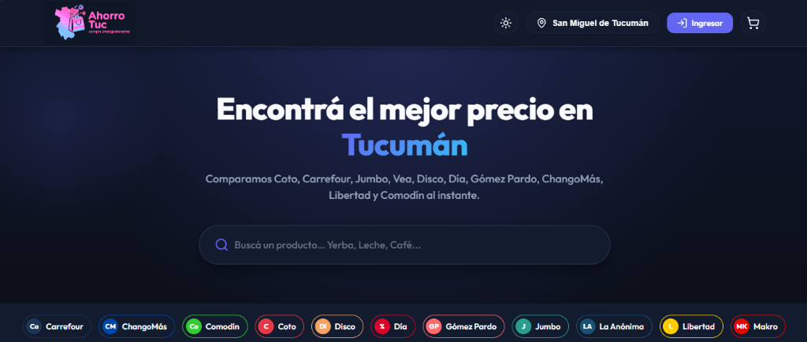
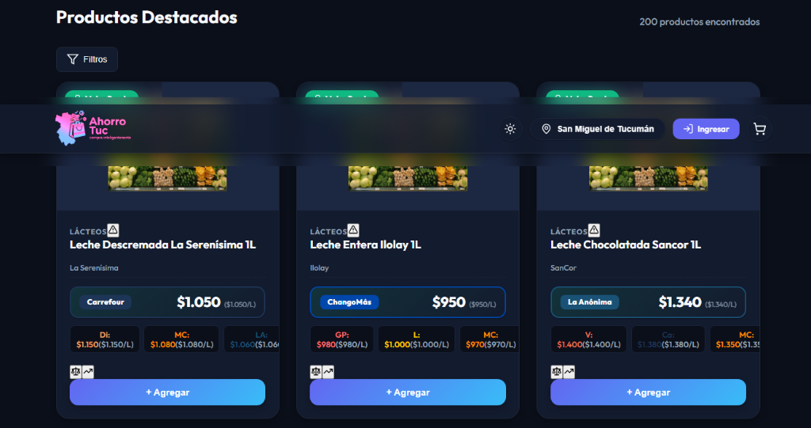
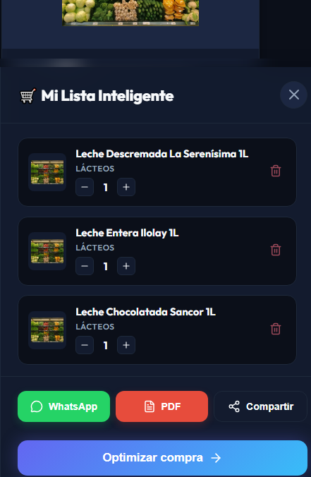

# 🛒 Ahorro Tuc

> **Comparador inteligente de precios de supermercados para Tucumán, Argentina.**

[](https://github.com/Alejopiola21/Project-Ahorro-Tuc/actions)

**Ahorro Tuc** es una plataforma web inteligente diseñada específicamente para los habitantes de San Miguel de Tucumán y alrededores. Nuestra misión es ayudar a las familias tucumanas a combatir la inflación y ahorrar dinero en sus compras cotidianas comparando precios en tiempo real entre **13 cadenas de supermercados**.

---

## 🖼️ Capturas de Pantalla

### 🔍 Buscador e Interfaz Principal (Hero & Categorías)


### 🏷️ Listado de Productos e Indicadores de Mejor Precio


### 🛒 Mi Lista Inteligente & Optimizador de Compra


---

## 🌟 ¿Por qué Ahorro Tuc?

En un contexto de constante variación de precios, saber dónde comprar puede significar un ahorro de miles de pesos al mes. **Ahorro Tuc** centraliza la información de las principales cadenas de supermercados de la provincia para que no tengas que recorrerlos físicamente.

## 🚀 Funcionalidades

| Feature | Descripción |
|---------|-------------|
| 🎨 **Rediseño Premium Impeccable** | Interfaz moderna con vidrio traslúcido (Glassmorphism), contraste HSL, animaciones spring y modo oscuro profundo. |
| 🔍 **Buscador Pro** | Búsqueda con filtros avanzados: texto, categoría, precio, marca y stock. |
| 🎛️ **Filtros Avanzados** | Panel de filtros colapsable: rango de precio, marcas, solo con stock, ordenamiento por precio/marca/nombre. |
| 🥇 **Indicador de Mejor Precio** | Resalta automáticamente el súper más barato. Incluye **Precio por Unidad** ($/Kg, $/L). |
| 🛒 **Carrito Híbrido** | El optimizador te dice si conviene dividir tu compra en dos locales para ahorrar el máximo posible. |
| 💡 **Sustitución Heurística** | Sugiere reducciones volumétricas más convenientes (ej. 2x 500g en lugar de 1x 1kg) en el carrito interactivo. |
| 🔑 **Magic Links** | Inicio de sesión rápido y registro sin contraseña mediante links de un solo uso. |
| 📱 **Compartir Lista** | Exportá tu lista optimizada directamente a WhatsApp, copiala al portapapeles o descargala como **PDF profesional**. |
| 📄 **Ticket PDF** | Generá un comprobante formal de tu lista con precios, totales y ahorros para imprimir o guardar. |
| 💰 **Cálculo de Ahorro** | Visualizá cuánto dinero ahorrás eligiendo la opción ganadora vs la más cara. |
| 🌙 **Modo Oscuro Profundo** | Toggle de tema claro/oscuro con paleta Slate/Indigo persistente. |
| 📱 **PWA Instalable** | Instalá la app en tu celular o PC como una app nativa offline-ready. |

## 🏪 Supermercados Incluidos

`Coto` · `Carrefour` · `Jumbo` · `Vea` · `Disco` · `Día` · `Gómez Pardo` · `ChangoMás` · `Libertad` · `Comodín` · `Maxiconsumo` · `La Anónima` · `Makro`

## 🆕 Novedades Recientes

| Fecha | Novedad | Descripción |
|-------|---------|-------------|
| **24/07/2026** | 🎨 **Rediseño Completo UI/UX v1.6** | Implementación del sistema de diseño **Impeccable & Ponytail**: Tokens CSS HSL, glassmorphic navbar, hero resplandeciente, tarjetas de productos con elevación y drawer de carrito optimizado. |
| **13/04/2026** | 🔑 **Magic Links** | Acceso inmediato y registro mediante enlaces temporales de 15 min. |
| **13/04/2026** | 💡 **Sustitución Inteligente** | Algoritmo heurístico para sugerir reducciones volumétricas rentables del mismo producto en el carrito. |
| **13/04/2026** | 🛡️ **Pool de Proxies Residenciales** | Rotación dinámica de IPs en el cliente HTTP (`fetcher.ts`) para mitigar bloqueos WAF (Anti-Ban). |
| **13/04/2026** | 🎛️ **Filtros Avanzados de Búsqueda** | Panel de filtros con precio, marcas, stock y ordenamiento. |
| **13/04/2026** | 📄 **Ticket PDF** | Generación de PDF profesional descargable desde el carrito con lista, precios y totales. |
| **13/04/2026** | 🚀 **Arquitectura 7.3** | Integración de **Redis** (Caché L2), **BullMQ** (Colas de Scraping) y **MeiliSearch**. |

## 🛠️ Stack Tecnológico

### Frontend
- **React 19** + **TypeScript** + **Vite 7**
- **CSS Vanilla (Design Tokens System)**: Variables HSL/OKLCH, Glassmorphism, animaciones spring, modo oscuro profundo
- **Zustand** para estado global del carrito (persistido en localStorage)
- **Axios** con interceptores globales + **Sonner** para toast notifications
- **Lucide React** para iconografía consistente
- **PWA** con `vite-plugin-pwa` (instalable, offline-ready)

### Backend
- **Node.js** + **Express 5** + **TypeScript**
- **BullMQ** para gestión de tareas asíncronas de scraping
- **MeiliSearch** para motor de búsqueda ultra-rápido NoSQL
- **Redis** para caché distribuida (L2) y respaldo de colas
- **Prisma ORM** con adapter nativo para PostgreSQL
- **Zod** para validación estricta de requests
- **Swagger** (OpenAPI 3.0) para documentación de API

### Base de Datos
- **PostgreSQL 15** con extensión `pg_trgm` para búsqueda difusa ultrarrápida
- Schema relacional con 6 modelos: `Supermarket`, `Product`, `Price`, `PriceHistory`, `ProductAlias`, `UserList`
- **Neon.tech** como proveedor Serverless (100% en la nube)

---

## ⚡ Inicio Rápido

### Prerrequisitos
- Node.js 18+
- Una cuenta en [Neon.tech](https://neon.tech/) para la base de datos PostgreSQL

### 1. Clonar e instalar
```bash
git clone https://github.com/Alejopiola21/Project-Ahorro-Tuc.git
cd Project-Ahorro-Tuc

# Instalar dependencias
cd frontend && npm install && cd ..
cd backend && npm install && cd ..

# Configurar variables de entorno
cp frontend/.env.example frontend/.env
cp backend/.env.example backend/.env
```

### 2. Configurar la base de datos
```bash
cd backend
npx prisma db push
npx prisma db seed
```

### 3. Iniciar el proyecto
```bash
# Terminal 1 - Backend
cd backend && npm run dev

# Terminal 2 - Frontend
cd frontend && npm run dev
```

### 4. Abrir en el navegador
- **Frontend**: http://localhost:5173
- **Backend API**: http://localhost:3001/api
- **Swagger Docs**: http://localhost:3001/api/docs

---

## 🏗️ Estado del Proyecto

| Fase | Nombre | Estado |
|------|--------|--------|
| 1.0 | Sistema de Tokens y Diseño Visual Impeccable | ✅ Completada |
| 2.0 | Rediseño Navbar Glassmorphic y Hero Interactivo | ✅ Completada |
| 3.0 | Rediseño Tarjetas de Productos e Indicadores | ✅ Completada |
| 4.0 | Rediseño Sidebar de Carrito y Resumen de Ahorro | ✅ Completada |
| 7.3 | Arquitectura Escalable (Redis + BullMQ + MeiliSearch) | ✅ Completada |
| 10.3 | Normalización de Precios por Unidad ($/Kg, $/L) | ✅ Completada |
| 12.3 | Generación de Ticket PDF y Compartir WhatsApp | ✅ Completada |
| 13.1 | Sustitución Heurística de Formato | ✅ Completada |

---

## 📄 Licencia

ISC

---

Diseñado con ❤️ para Tucumán.
